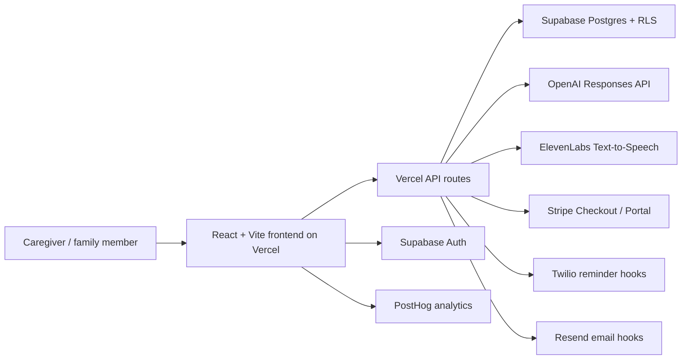

# CareSpark Submission Pack

## 1. Project Name And Team

Project name: CareSpark

Team members:
- Kireeti: founder, product strategy, full-stack build, healthcare workflow design

## 2. Problem Statement And Target User

Family caregivers often become the invisible operating layer for eldercare. They must coordinate appointments, grants, claims, medication context, documents, siblings, respite, and emotional strain while still managing work and family life.

CareSpark targets Singapore family caregivers first, especially working adult children, sandwich-generation caregivers, dementia family leads, and long-distance siblings. The expansion path is B2B2C through employers, care providers, insurers, and community partners.

## 3. Two To Three Sentence Solution Summary

CareSpark turns caregiver overwhelm into a shared care operating system: a calm onboarding flow creates a personalized dashboard with grants and bills, support channels, family tasks, wellbeing prompts, documents, and community support. OpenAI powers the natural-language care guide and task help, ElevenLabs adds hands-free voice briefs, Supabase stores private care plans and demand signals, and Stripe/Twilio/Resend/PostHog prepare the product for subscriptions, reminders, email, and growth analytics. The challenge was to keep the product powerful without making caregivers feel like they had another task to manage; the result is a guided, user-facing journey backed by a full-stack MVP.

## 4. Demo Video Script, Max 3 Minutes

Target length: 2:30 to 2:50.

1. 0:00-0:20, problem:
   "Caregiving is not just emotional support. It is a hidden operating system of grants, documents, appointments, siblings, reminders, and burnout risk. CareSpark helps families turn that chaos into one shared plan."

2. 0:20-0:45, public site:
   Show the homepage, benefit sections, evidence signals, voice-support layer, pricing, and pilot capture. Say that caregivers are not shown developer tools or API details.

3. 0:45-1:20, dashboard:
   Click "Start free check" and "View demo dashboard." Show the six top directory cards. Click Grants & bills, Support channels, Documents, Wellbeing, Community, then return to the Family task board.

4. 1:20-1:55, AI workflow:
   Open "Ask CareSpark." Ask: "What support should I check for Mum?" Then type: "add task call AIC about respite options." Show the task appearing on the board.

5. 1:55-2:20, ElevenLabs:
   Click "Read brief aloud" in the assistant or "Play voice brief" on the public site. Explain that voice helps caregivers when they are hands-busy, commuting, or too overwhelmed to read another screen.

6. 2:20-2:50, business and close:
   Show pricing and explain the wedge: free check, family coordination subscription, care-circle upgrade, and guided setup. Close with: "CareSpark does not replace care providers; it reduces the admin and emotional drag around care so families can show up earlier and better."

## 5. Live Demo, Prototype, And Screenshots

Live demo:
- https://the-first-spark.vercel.app

Judge-facing submission page:
- https://the-first-spark.vercel.app/submission

Recommended screenshots to attach:
- Homepage with evidence and onboarding promise
- Dashboard overview with six clickable directories and family task board
- Support channels page with external source links
- CareSpark assistant adding a task
- Submission page scorecard or architecture section

Local screenshot folder after verification:
- `artifacts/screenshots/`

## 6. Pitch Deck, 10 Slides Max

1. Title: CareSpark, caregiving support made lighter
2. Problem: Caregiving is an invisible operating burden, not just an emotional role
3. Target user: Singapore family caregivers, starting with working adult children
4. Current alternatives: search, WhatsApp, paper notes, provider calls, fragmented government pages
5. Solution: one personalized care operating system
6. Product demo: onboarding, dashboard, support directories, family task board, assistant, voice brief
7. AI and tech architecture: OpenAI, ElevenLabs, Supabase, Vercel, Stripe, Twilio, Resend, PostHog
8. Business model and GTM: free check, family subscription, care-circle plan, guided setup, employer/provider pilots
9. Evidence and validation: public Singapore ageing/caregiver signals, proxy sentiment layers, pilot capture, next 3-5 interviews
10. Roadmap and ask: launch pilot, collect caregiver quotes, integrate WhatsApp/calendar, partner with care providers

## 7. Tools Used

- OpenAI: natural-language care assistant, service explanation, task support
- ElevenLabs: text-to-speech voice briefs and future conversational voice layer
- Supabase: auth, Postgres, RLS, care plans, care circles, support directory, pilot leads, product events
- Vercel: production deployment and serverless API routes
- Stripe: subscription checkout and customer portal routes
- Twilio: WhatsApp/SMS reminder hooks
- Resend: email follow-up placeholder
- PostHog: product analytics placeholder
- React, Vite, TypeScript: frontend application
- Lucide React: icon system

## 8. Technical Architecture

Core routes:
- `/` public caregiver-facing site
- `/signin` email magic-link sign-in and demo dashboard entry
- `/app/dashboard` private caregiver dashboard
- `/app/grants`, `/app/support`, `/app/tasks`, `/app/wellbeing`, `/app/documents`, `/app/community`
- `/pricing` subscription page
- `/submission` judge-facing summary page
- `/admin` founder-only research and GTM workspace

Important API routes:
- `POST /api/chat-assistant`
- `POST /api/elevenlabs-speech`
- `POST /api/care-plan`
- `POST /api/lead`
- `POST /api/event`
- `POST /api/create-checkout-session`
- `POST /api/create-portal-session`
- `GET /api/health`

## 9. User Feedback And Demand Evidence

Current evidence:
- Public Singapore ageing and caregiver-load signals are shown in the app.
- Proxy interview layers are stored in the founder workspace.
- Pilot-demand capture is live on the public site through `/api/lead`.
- The strongest open gap is still real user quotes.

Collect before final submission if possible:
- 3-5 caregiver quotes
- 5-10 pilot waitlist entries
- One short screenshot of leads or survey results
- One quote from a provider, HR lead, or social worker if available

Fast survey prompt:
1. What is the most exhausting part of caregiving admin right now?
2. What do you currently use to coordinate family help?
3. Which would help most: grants checklist, task board, document pack, reminders, voice guide, or peer support?
4. Would you pay S$14.90/month if it saved 1-2 hours per week?
5. What would make you trust or distrust this product?

Quote template:
- Persona:
- Situation:
- Pain quote:
- Current workaround:
- Most useful CareSpark feature:
- Willingness to pay or pilot interest:

## 10. Submission Checklist

- Project name: CareSpark
- Team members: Kiree plus any additional teammates
- Problem statement and target user: use sections 2 and 3
- Solution summary: use section 3
- Demo video: record section 4
- Live demo link: https://the-first-spark.vercel.app
- Judge page: https://the-first-spark.vercel.app/submission
- Pitch deck: build from section 6
- Tools used: section 7
- GitHub repo: add your repository URL
- Figma file: add if created; otherwise use screenshots and live prototype
- Technical architecture: section 8
- User feedback: attach quotes, waitlist entries, or survey output collected before upload

## 11. Critical Judging Notes

Estimated score after this upgrade: 84/100.

Remaining risk:
- The product is strong, but "Evidence of Real Demand" still depends on real caregiver quotes or waitlist entries. The live pilot capture helps, but actual quotes are the fastest way to become winner-safe.

Best last-mile move:
- Get 3 caregiver conversations tonight or tomorrow morning. Ask only the five survey questions above. Add the strongest quotes to the deck and submission form.
