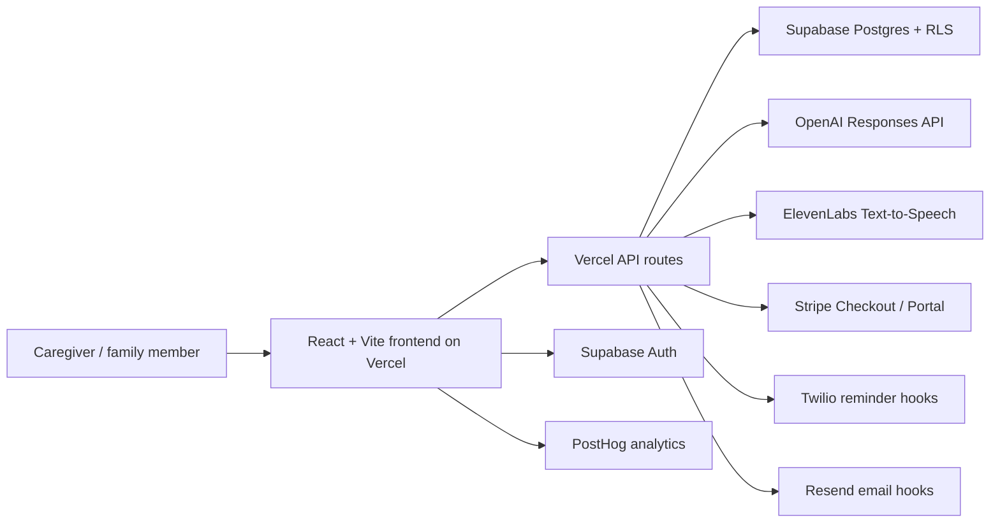

# CareSpark Submission Pack

## 1. Project Name And Team

Project name: CareSpark

Team members:
- Kireeti: founder, product strategy, full-stack build, healthcare workflow design

## 2. Problem Statement And Target User

Family caregivers often become the invisible operating layer for eldercare. They must coordinate appointments, grants, claims, medication context, documents, siblings, respite, and emotional strain while still managing work and family life.

CareSpark targets Singapore family caregivers first, especially working adult children, sandwich-generation caregivers, dementia family leads, and long-distance siblings. The expansion path is B2B2C through employers, care providers, insurers, and community partners.

## 3. Solution Summary

CareSpark turns caregiver overwhelm into a shared care operating system: a calm onboarding flow creates a personalized dashboard with grants and bills, support channels, family tasks, wellbeing prompts, documents, and community support. OpenAI powers the natural-language care guide and task help, ElevenLabs adds hands-free voice briefs, Supabase stores private care plans and demand signals, and Stripe/Twilio/Resend/PostHog prepare the product for subscriptions, reminders, email, and growth analytics. The challenge was to keep the product powerful without making caregivers feel like they had another task to manage; the result is a guided, user-facing journey backed by a full-stack MVP.

## 4. Live Demo, Prototype, And Screenshots

Live demo:
- https://the-first-spark.vercel.app

## 5. Tools Used

- OpenAI: natural-language care assistant, service explanation, task support
- ElevenLabs: text-to-speech voice briefs and future conversational voice layer
- Supabase: auth, Postgres, RLS, care plans, care circles, support directory, pilot leads, product events
- Vercel: production deployment and serverless API routes
- Stripe: subscription checkout and customer portal routes
- Twilio: WhatsApp/SMS reminder hooks
- Resend: email follow-up placeholder
- PostHog: product analytics placeholder
- React, Vite, TypeScript: frontend application
- Lucide React: icon system

## 6. Technical Architecture

Core routes:
- `/` public caregiver-facing site
- `/signin` email magic-link sign-in and demo dashboard entry
- `/app/dashboard` private caregiver dashboard
- `/app/grants`, `/app/support`, `/app/tasks`, `/app/wellbeing`, `/app/documents`, `/app/community`
- `/pricing` subscription page
- `/submission` judge-facing summary page
- `/admin` founder-only research and GTM workspace

Important API routes:
- `POST /api/chat-assistant`
- `POST /api/elevenlabs-speech`
- `POST /api/care-plan`
- `POST /api/lead`
- `POST /api/event`
- `POST /api/create-checkout-session`
- `POST /api/create-portal-session`
- `GET /api/health`
